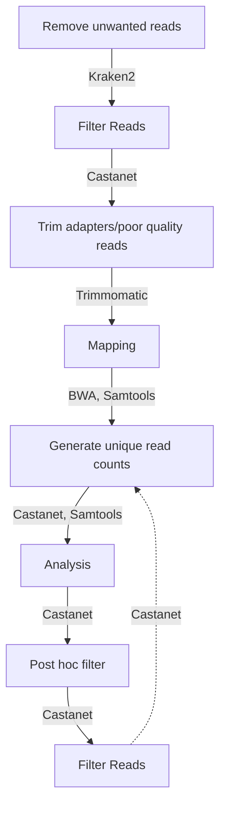

# Castanet fork - Python 3 with self-installation and convenience functions
Rich Mayne 2023
## Installation
### Prerequisites
We assume the user has installed the following. See attached links for guidance if not.
1. A Linux-like environment: tested on Ubuntu 22.04 and Windows Subsystems Linux (WSL2) Ubuntu 22.04. User experience with Windows/Mac will vary.
1. Conda (for installing external dependency, Kraken2). See https://docs.conda.io/projects/conda/en/latest/user-guide/install/linux.html
1. Python > 3.7 <= 3.12, ideally installed specifically to a Conda environment made for running Castanet.
1. Java runtime environment (for running external dependency, Trimmomatic). See https://www.java.com/en/download/manual.jsp 

### Dependencies
We include a shell script for installing all other dependencies (tested on Ubuntu 22.04). These may be installed via:
```sudo bash install_deps.sh```


## Changelog
### Version 1, 14/06/23
1. Python scripts naturalised to Python3
1. Python scripts adapted to OOP practices for security and speed
1. Unified API with end-to-end workflow endpoint
1. Vectorization enhancements
1. Project and working directory structure
1. Dependency installer shell script
1. Experiment directory management functions
1. Example experiment readme

## Workflow


## Entrypoint Arguments
### Analysis
```bash
process_pool_grp.py -h

usage: process_pool_grp.py [-h] -b BATCHNAME -i INFILE [-o OUTDIR]
                           [-p PROBELENGTHS] [-d] --samples SAMPLES
                           [--clin CLIN] [--depth_inf DEPTH_INF]

optional arguments:
  -h, --help            show this help message and exit
  -b BATCHNAME, --batchname BATCHNAME
                        Batch name for these samples. Must be alphanumeric.
  -i INFILE, --infile INFILE
                        Data frame (csv[.gz]) file to process. If gzipped,
                        filename must end in .gz.
  -o OUTDIR, --outdir OUTDIR
                        Output directory. Default: current working directory.
  -p PROBELENGTHS, --probelengths PROBELENGTHS
                        Path to file containing probe lengths. Default:
                        $CASTANET_PATH/scripts/probelengths_rmlst_virus_extra_ercc.csv
  -d, --keepdups        If true, do not reassign duplicates to the sample with
                        the majority in each duplicate cluster (Default:
                        False).
  --samples SAMPLES     Path to CSV file containing information about raw
                        reads (must have at least following fields: sampleid,
                        pt, rawreadnum). Field "pt" must match clinical data.
  --clin CLIN           Path to CSV file containing clinical data (must have
                        at least following fields: pt, clin_int; the field
                        "sampleid" if present will be ignored). Other fields
                        will be ignored.
  --depth_inf DEPTH_INF
                        (For regenerating full CSV with new clinical info):
                        Path to previously generated CSV file of read depth
                        per position for each probe, for all samples in this
                        batch. Must contain the following fields: sampleid,
                        target_id, depth_mean, depth_std, depth_25pc,
                        depth_median, depth_75pc, prop_target_covered,
                        prop_target_covered_mindepth2,
                        prop_target_covered_mindepth5,
                        prop_target_covered_mindepth10, udepth_mean,
                        udepth_std, udepth_25pc, udepth_median, udepth_75pc,
                        uprop_target_covered, uprop_target_covered_mindepth2,
                        uprop_target_covered_mindepth5,
                        uprop_target_covered_mindepth10

Example: process_pool_grp.py -i /path/to/my/dataframe.csv.gz --samples
/path/to/sampleinfo.csv
```