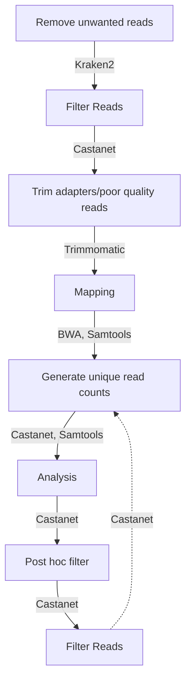

```
 _____           _                   _   
/  __ \         | |                 | |  
| /  \/ __ _ ___| |_ __ _ _ __   ___| |_ 
| |    / _` / __| __/ _` | '_ \ / _ \ __|
| \__/\ (_| \__ \ || (_| | | | |  __/ |_ 
 \____/\__,_|___/\__\__,_|_| |_|\___|\__|
                                         
O       o O       o O       o O       o O
| O   o | | O   o | | O   o | | O   o | |
| | O | | | | O | | | | O | | | | O | | |
| o   O | | o   O | | o   O | | o   O | |
o       O o       O o       O O       O o
```

Forked from https://github.com/tgolubch/castanet, originally described in https://doi.org/10.1101/716902

This implementation is written in Python 3 and has additional convenience features, such as end-to-end workflows, optimizations, automated installation of dependencies and an API compatible with containerization.
## Installation
### Prerequisites
We assume the user has installed the following. See attached links for guidance if not.
1. A Linux-like environment: tested on Ubuntu 22.04 and Windows Subsystems Linux (WSL2) Ubuntu 22.04. User experience with Windows/Mac will vary.
1. Conda (for installing external dependency, Kraken2). See https://docs.conda.io/projects/conda/en/latest/user-guide/install/linux.html
1. Python > 3.7 <= 3.12, ideally installed specifically to a Conda environment made for running Castanet.
1. Java runtime environment (for running external dependency, Trimmomatic). See https://www.java.com/en/download/manual.jsp 

### Dependencies
We include a shell script for installing all other dependencies (tested on Ubuntu 22.04). These may be installed via:
```sudo bash install_deps.sh```

## Example workflow, using original script functionality
N.B. some optional parameters from the original scripts are hard-coded. Full and extended functionality is offered in the API.
### Prerequisites
We assume the user has the following files to hand and wishes to create an experiment with the following parameters:
1. Two paired read sequence files with name root ```mysample```, labelled ```..._1, ..._2```
1. A directory for storing and saving data, called ```data/```
1. A CSV file describing the contents of both samples in #1, containing as a minimum the fields "sampleid" (i.e. mysample_1...), "pt" and "rawreadnum", in the following direcotry ```data/samples.csv```
1. A reference fasta file containing consensus target sequences, called ```myrefstem.fasta```
1. A file in your Trimmomatic directory (set up in step #2, below), contining adapter sequences specific to your NGS technique, in the following directory ```Trimmomatic-0.39/adapters/all.fa``` (this is the default value)
1. A CSV file containing probe length mappings, in the following directory ```data/probes.csv```

### Run commands
1. Install prerequisites
1. Install dependencies with ```sudo bash install_deps.sh```
1. Call end-to-end script with ```python3 app/end_to_end_script.py -ExpDir data/ -SeqName mysample -RefStem myrefstem.fasta -PostFilt True -Samples data/samples.csv -Probes data/probes.csv```


## Workflow


## Function descriptions
### Preprocess
Calls Kraken2, which is a command line tool for doing taxonomic classification using exact k-mer matches, to identify human (genomic and mitochondrial) raw reads, as well as common contaminants. Output are called in the next pipeline step and removed prior to analysis. For more details, see ```https://ccb.jhu.edu/software/kraken2/```

*Input args*
1. Kraken database directory (set up automatically through running ```install_deps.sh```)
1. Threads. Number of individual processes to be run concurrently.
1. Input file, in fastq.gz format. Castanet automatically generates the input sequence name directory from ExpDir and SeqName arguments. *We assume your two files will be named as follows: {ExpDir}{SeqName}_1.fastq.gz, {ExpDir}{SeqName}_2.fastq.gz*.
1. Output file, in .kraken format. Castanet is hard coded to produce output in the following format: {ExpDir}{SeqName}_1.kraken.

### Filter keep reads


## Dependency notes
### Lineage file
We have included a lineage file in the repo for convenience. Users may generate up-to-date files using the repository below.

``` https://github.com/zyxue/ncbitax2lin  ```

### Mapper
We opt for bwa-mem2 for doing Burrows Wheeler alignment. 

```https://github.com/bwa-mem2/bwa-mem2```

Castanet is not tested with original bwa, bowtie2 etc. but may be compatible. 

## Changelog
### Version 1, 14/06/23
1. Python scripts naturalised to Python3
1. Project and working directory structure
1. Dependency installer shell script
1. Experiment directory management functions
1. Refresh example experiment in readme to fit end to end workflow script

### To do
1. Python scripts adapted to OOP practices for security and speed
1. Git hooks for contributors
1. Unified API with end-to-end workflow endpoint
1. Vectorization enhancements
1. Containerize
1. Unit tests
