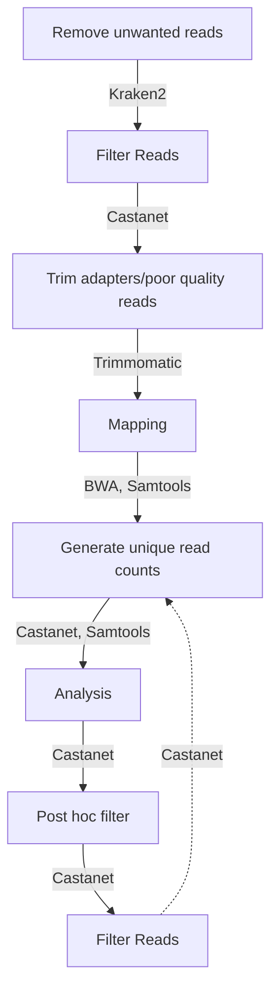

```
 _____           _                   _
/  __ \         | |                 | |
| /  \/ __ _ ___| |_ __ _ _ __   ___| |_
| |    / _` / __| __/ _` | '_ \ / _ \ __|
| \__/\ (_| \__ \ || (_| | | | |  __/ |_
 \____/\__,_|___/\__\__,_|_| |_|\___|\__|

O       o O       o O       o O       o O
| O   o | | O   o | | O   o | | O   o | |
| | O | | | | O | | | | O | | | | O | | |
| o   O | | o   O | | o   O | | o   O | |
o       O o       O o       O O       O o
```

Forked from https://github.com/tgolubch/castanet, originally described in https://doi.org/10.1101/716902

This implementation is written in Python 3 and has additional convenience features, such as end-to-end workflows, optimizations, automated installation of dependencies and an API compatible with containerization.
# Installation
## Prerequisites
We assume the user has installed the following. See attached links for guidance if not.
1. A Linux-like environment: tested on Ubuntu 22.04 and Windows Subsystems Linux (WSL2) Ubuntu 22.04. User experience with Windows/Mac will vary.
1. Conda (for installing external dependency, Kraken2). See https://docs.conda.io/projects/conda/en/latest/user-guide/install/linux.html
1. Python > 3.7 <= 3.12, ideally installed specifically to a Conda environment made for running Castanet.
1. Java runtime environment (for running external dependency, Trimmomatic). See https://www.java.com/en/download/manual.jsp

## Dependencies
We include a shell script for installing all other dependencies (tested on Ubuntu 22.04). These may be installed via:
```sudo bash install_deps.sh```

# Example workflows


## Prerequisites
We assume the user has the following files to hand and wishes to create an experiment with the following parameters:
1. Two paired read sequence files with name root ```mysample```, labelled ```..._1, ..._2```
1. A directory for storing and saving data, called ```data/```
1. A CSV file describing the contents of both samples in #1, containing as a minimum the fields "sampleid" (i.e. mysample_1...), "pt" and "rawreadnum", in the following direcotry ```data/samples.csv```
1. A reference fasta file containing consensus target sequences, called ```myrefstem.fasta```
1. A file in your Trimmomatic directory (set up in step #2, below), contining adapter sequences specific to your NGS technique, in the following directory ```Trimmomatic-0.39/adapters/all.fa``` (this is the default value)
1. A CSV file containing probe length mappings, in the following directory ```data/probes.csv```

## Example workflow, using API (recommended)
### Run commands
1. Install prerequisites
1. Install dependencies with ```sudo bash install_deps.sh```
1. Start an API server with ```uvicorn app.api:app --reload```
1. Visit API home page in your browser, using address ```http://127.0.0.1:8000/docs```
1. Expand green drop-downs to explore individual functions. "Try it out" button (top right of expanded green boxes) allow you to change arguments in text box. When you're happy with the input arguments, trigger the function with the large blue "Execute" button. Details of output, including run information and errors, are shown in the terminal that was used to launch the API server.

N.b. pay attention to your argument type: strings should be encased in double quotes, whereas numbers and booleans (true, false) don't need to be. Any arguments that default to empty ('"ArgName": ""') are optional and may be left blank

## Example workflow, using original script functionality
N.B. some optional parameters from the original scripts are hard-coded. Full and extended functionality is offered in the API.

### Run commands
1. Install prerequisites
1. Install dependencies with ```sudo bash install_deps.sh```
1. Call end-to-end script with ```python3 app/end_to_end_script.py -ExpDir data/ -SeqName mysample -RefStem myrefstem.fasta -PostFilt True -Samples data/samples.csv -Probes data/probes.csv```

# Container setup
An example dockerfile and build/run scripts are included for guidance only.

1. Install Docker ```https://docs.docker.com/get-docker/```
1. Build and run container ```bash build.sh && bash run.sh```

Users are encouraged to consult a system admin if they experience issues with building, accessing or deploying containers.

# Function descriptions
## Input arguments common to multiple functions
1. Experiment directory [ExpDir]. Folder where data is stored and may be saved.
1. Experiment name [ExpName]. Name used to prefix final output.
1. Sequence name [SeqName]. name common to your input sequences, without prefixes, suffixes or file extensions. N.b. we assume your data will have the following format: {ExpDir}{SeqName}_1.fasta.gz, {ExpDir}{SeqName}_2.fasta.gz.
1. Threads [NThreads]. Number of individual processes to be run concurrently.

## Preprocess
Calls Kraken2, which is a command line tool for doing taxonomic classification using exact k-mer matches, to identify human (genomic and mitochondrial) raw reads, as well as common contaminants. Output are called in the next pipeline step and removed prior to analysis. For more details, see ```https://ccb.jhu.edu/software/kraken2/```

*Input args*
1. Kraken database directory [KrakenDbDir] (set up automatically through running ```install_deps.sh```).

*Output*
1. {ExpDir}{SeqName}_1.kraken. Kraken2 output file.

## Filter keep reads
Calls Castanet FilterKeepReads class, which makes lists of reads from raw sequences, identified via Kraken2, that are to be retained or removed. There are user-specified options for expanding these rules, through comparison with an input file of lineages. Users may generate such a file, see below: Dependency notes > Lineage file. Final step is to do the filter and save the output to a compressed fastq file.

*Input args*
1. (Optional) Lineage file [LineageFile], in .csv or .gz format. N.b. user is expected to supply the directory and file extension.
1. (Optional) Exclude IDs [ExcludeIds]. NCBI TaxIDs from lineage file to exclude from analysis. Recommend to use default TaxID 9606 (human).
1. (Optional) Retain IDs [RetainIds]. NCBI TaxIDs from lineage file to retain in analysis.
1. (Optional) List of names to exclude [ExcludeNames]. Taxonomic names to exclude, which are searched for in the input lineage file and converted into TaxIDs. Must be a comma separated list with no spaces.
1. (Optional) List of names to retain [RetainNames]. Taxonomic names to retain, which are searched for in the input lineage file and converted into TaxIDs. Must be a comma separated list with no spaces.

*Output*
1. Filtered sequence files: {ExpDir}{SeqName}_[12]_filt.fastq

## Trim data
Uses Trimmomatic to remove low quality reads and sequencer adapters. We assume this tool will be installed as described in the automated installer script, in particular with regard to version and directory, as these are hard-coded in the call (in app/src/trim_adapters.py). Input files are filtered *_filt.fasta.gz from previous stage, and output are trimmed versions of the input in addition to separate (temp) files containing the trimmings.

*Input args*
1. Adapters file [AdaptP]: Path to .fa file containing adapter sequences. For convenience, we have included a file in the /data/ directory containing several commonly-used adapters, but the Trimmomatic tool will also download a number of individual files specific to sequencing technique in its root directory.

*Output*
1. Trimmed files: {ExpDir}{SeqName}_[12]_clean.fastq
1. Trimmings files: {ExpDir}{SeqName}_[12]_trimmings.fastq

## Map reads to reference
Uses BWA algorithm to map reads against reference sequences. Initial step is to index the reference .fasta file (not included!), after which mem function is used to map your cleaned input sequences against the indexed references. Samtools are then used to map the output to the shell, which are then sorted and saved as a compressed alignment map (*.bam) file.

*Input args*
1. Reference sequence file [RefStem]. Reference sequences in .fasta format. Not included in repo as results are likely to be sensitive. Castanet will look for file in your data directory by default.

*Output*
1. Compressed alignment map file: {ExpDir}{SeqName}.bam

## Generate counts
Iterate over bam files in your experiment directory (N.b. this is a batching function! Ensure you know which files are present in this directory before using!), decrypt to SAM format and print to terminal; output are piped directly to Castanet parse_bam functions to produce a CSV file containing position counts. Parse BAM functions are multi functional - this entrypoint specifies to do only the "parse" functions, which generate counts for uniquely mapped sequences identified. Functions can differentiate between properly paired matches (with a suitably-long match length) and badly paired but sufficiently long sequence match.

*Input args*
(No non-generic input)

*Output*
1 CSV file containing counts: {ExpDir}PosCounts.csv

## Analysis

*Input args*
1. Probe lengths list [Probes]. CSV file containing list of probes and their respective lengths, with headers {target_id, target_len}. User must specify input folder and file extension.
1. Sample mapping file [Samples]. CSV file containing information about raw reads, with headers {sampleid,pt,rawreadnum}. Field "pt" must match clinical data, if specified.
1. (OPTIONAL) Clinical data file [Clin]. CSV contianing clinical details, which may be mapped to samples via Samples file pt field.
1. (OPTIONAL) Path to previously generated file containing read depts [DepthInf]. Used for regenerating full CSV of results with clinical info. Must contain headers {sampleid,
                        target_id, depth_mean, depth_std, depth_25pc,
                        depth_median, depth_75pc, prop_target_covered,
                        prop_target_covered_mindepth2,
                        prop_target_covered_mindepth5,
                        prop_target_covered_mindepth10, udepth_mean,
                        udepth_std, udepth_25pc, udepth_median, udepth_75pc,
                        uprop_target_covered, uprop_target_covered_mindepth2,
                        uprop_target_covered_mindepth5,
                        uprop_target_covered_mindepth10}.

*Output*
1. Directory of coverage plots: Depth_{ExpName}
1. Number and proportion of reads for each sample and reference: {ExpName}_depth.csv. (Positives may need to be calibrated against a reference set, but in general, the proportion of all clean reads that match the given target (clean_prop_of_reads_on_target) is a good place to start.)
1. File containing reads to drop for post filter removal of misassigned reads: {ExpName}_reads_to_drop.csv.

## Post filter
Output of analysis (misassigned reads) may be used to post (downstream) filter input BAM file. Uses Samtools to decode and parse contents of BAM file, which are piped to Casta parse_bam functions (ONLY filter functions).

*Input args*
(No non-generic input)

*Output*
1. Compressed alignment map file: {ExpDir}{SeqName}.bam

# Dependency notes
## Lineage file
We have included a lineage file in the repo for convenience. Users may generate up-to-date files using the repository below.

``` https://github.com/zyxue/ncbitax2lin  ```

## Mapper
Mapping is an essential process to Castanet, which involves comparing our experiment reads with a number of pre-defined reference sequences. We opt for bwa-mem2 for doing Burrows Wheeler alignment.

```https://github.com/bwa-mem2/bwa-mem2```

Castanet is not tested with original bwa, bowtie2 etc., but may be compatible.

## Samtools
Samtools is a collection of software libraries that provides a range of functions for interrogating NGS data, specifically in Sequence Alignment Map (SAM) format and the compressed Binary- (BAM) format. These functions include reading, writing and viewing the contents of these files.

```http://www.htslib.org/```

## Trimmomatic
Trimming is an essential quality control process for removing sequence fragments that would contaminate our analyses. Specifically, we use Trimmomatic here to remove both low quality reads and our Illumina adapters (via MINLEN and ILLUMINACLIP functions).

```http://www.usadellab.org/cms/?page=trimmomatic```


# Changelog
## Version 1, 14/06/23
1. Python scripts naturalised to Python3
1. Project and working directory structure
1. Dependency installer shell script
1. Experiment directory management functions
1. Refresh example experiment in readme to fit end to end workflow script
1. Python scripts adapted to OOP practices for security and speed
1. Unified API with end-to-end workflow endpoint
1. Git hooks for contributors
1. Containerization

# Guide for contributors

Although forking is encouraged, we will only consider pull requests which address bugs and performance issues. Contributors will please configure pre-commit hooks to match ours, as detailed in the .pre-commit-config.yaml file.

1. Install Python dependencies with ```pip install -r requirements.txt```
1. Initialise pre-commit with ```pre-commit install```
1. Initialize commitizen ```cz init```

# Disclaimer
The material embodied in this software is provided to you "as-is", “with all faults”, and without warranty of any kind, express, implied or otherwise, including without limitation, any warranty of fitness for a particular purpose, warranty of non-infringement, or warranties of any kind concerning the safety, suitability, lack of viruses, inaccuracies, or other harmful components of this software. There are inherent dangers in the use of any software, and you are solely responsible for determining whether this software is compatible with your equipment and other software installed on your equipment. You are convert_fasta_to_genbankalso solely responsible for the protection of your equipment and backup of your data, and the developers/providers will not be liable for any damages you may suffer in connection with using, modifying, or distributing this software. Without limiting the foregoing, the developers/providers make no warranty that: the software will meet your requirements; the software will be uninterrupted, timely, secure, or error-free; the results that may be obtained from the use of the software will be effective, accurate, or reliable; the quality of the software will meet your expectations; any errors in the software will be identified or corrected.

Software and its documentation made available here could include technical or other mistakes, inaccuracies, or typographical errors. The developers/providers may make changes to the software or documentation made available here may be out of date, and the developers/providers make no commitment to update such materials.

The developers/providers assume no responsibility for errors or omissions in the software or documentation available from here.

In no event shall the developers/providers be liable to you or anyone else for any direct, special, incidental, indirect, or consequential damages of any kind, or any damages whatsoever, including without limitation, loss of data, loss of profit, loss of use, savings or revenue, or the claims of third parties, whether or not the developers/providers have been advised of the possibility of such damages and loss, however caused, and on any theory of liability, arising out of or in connection with the possession, use, or performance of this software.

The use of this software is done at your own discretion and risk and with agreement that you will be solely responsible for any damage to your computer system, or networked devices, or loss of data that results from such activities. No advice or information, whether oral or written, obtained by you from the developers/providers shall create any warranty for the software.
